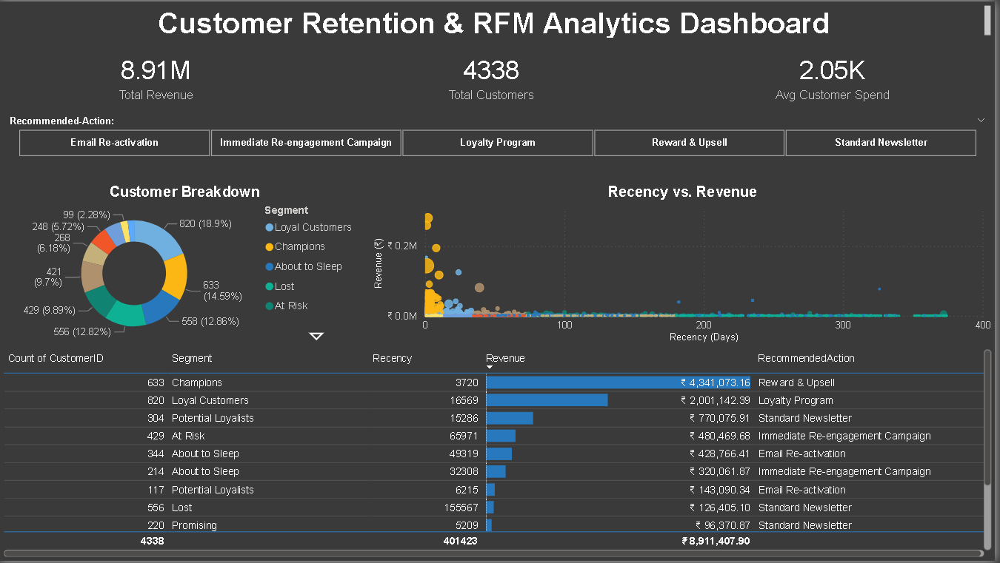

# Customer Retention & RFM Analytics Pipeline

> **End-to-end data engineering project** demonstrating a production-style ETL pipeline, relational data warehousing, and executive BI dashboarding — applied to 500K+ real e-commerce transactions.

---
## Dashboard Preview



---

## Business Problem

E-commerce businesses lose 20–40% of their customers every year. Indiscriminate marketing wastes budget on customers who were never going to churn, while genuinely at-risk high-value customers receive no targeted intervention. 

**This project answers:** *Which customers are about to leave, and how much revenue is at stake?*

---

## Architecture Overview

```
┌──────────────────────────────────────────────────────────────────┐
│  RAW DATA          LAYER 1: ETL         LAYER 2: WAREHOUSE       │
│  ─────────         ────────────         ──────────────────        │
│  UCI Online   ──►  Python / Pandas  ──►  MySQL rfm_scores table  │
│  Retail CSV        Clean + Score         + vw_customer_segments  │
│  (541K rows)       RFM metrics           VIEW (business logic)   │
└──────────────────────────────────────────────────────────────────┘
                                                    │
                                                    ▼
                                         LAYER 3: BI DASHBOARD
                                         ─────────────────────
                                         Power BI → MySQL View
                                         Donut / Scatter / KPIs
```

---

## Dataset

| Property       | Detail                                                         |
|----------------|----------------------------------------------------------------|
| Source         | [UCI ML Repository via Kaggle (carrie1)](https://www.kaggle.com/datasets/carrie1/ecommerce-data) |
| Records        | 541,909 rows                                                   |
| Time Period    | Dec 2010 – Dec 2011                                           |
| Geography      | UK-based online retailer, ships globally                       |
| Key Fields     | `InvoiceNo`, `CustomerID`, `Quantity`, `UnitPrice`, `InvoiceDate` |

---

## RFM Methodology

**RFM** (Recency, Frequency, Monetary) is an industry-standard behavioral segmentation framework used by Shopify, Salesforce Marketing Cloud, and Klaviyo.

| Metric        | Definition                              | Scoring Logic           |
|---------------|-----------------------------------------|-------------------------|
| **Recency**   | Days since last purchase                | Lower = Higher score    |
| **Frequency** | Number of unique invoices               | Higher = Higher score   |
| **Monetary**  | Total revenue generated (£)            | Higher = Higher score   |

Each metric is scored **1–5** using quantile binning. Scores are combined (max = 15) and used to classify customers into **11 business segments**.

### Customer Segments

| Segment              | Description                                          | Action                      |
|----------------------|------------------------------------------------------|-----------------------------|
| 🏆 Champions          | Recent, frequent, high-spend                        | Reward & upsell             |
| 💚 Loyal Customers    | Regular buyers, respond to promotions               | Loyalty program             |
| 🌱 Potential Loyalists| Recent with average frequency                       | Nurture sequence            |
| ⚠️ At Risk            | High past value, haven't returned in months         | Re-engagement campaign      |
| 🚨 Cannot Lose Them   | VIP customers, dangerously inactive                 | Personal win-back offer     |
| 💤 Hibernating        | Low scores across the board                         | Discount reactivation       |
| ❌ Lost               | Lowest recency, frequency, and spend                | Sunset or minimal effort    |

---

## Data Cleaning Decisions

| Issue                              | Decision                            | Rationale                                         |
|------------------------------------|-------------------------------------|--------------------------------------------------|
| 135,080 rows with null CustomerID  | **Dropped**                         | Cannot attribute revenue without customer identity |
| Negative Quantity (returns)        | **Removed**                         | Returns distort Monetary and Frequency metrics    |
| Zero/negative UnitPrice            | **Removed**                         | Likely test entries or data entry errors          |
| Invoices starting with "C"         | **Removed**                         | Cancellation codes, not real purchases            |

---

## Project Structure

```
rfm-analytics-pipeline/
│
├── data/
│   ├── raw/
│   │   └── ecommerce_data.csv          ← Download from Kaggle (not tracked by Git)
│   └── processed/
│       ├── rfm_scores.csv              ← Output of ETL pipeline (audit trail)
│       └── eda_plots/                  ← EDA diagnostic charts
│
├── scripts/
│   ├── eda.py                          ← Exploratory Data Analysis
│   └── etl_pipeline.py                ← Main ETL: Extract → Clean → Transform → Load
│
├── sql/
│   ├── 01_setup_database.sql           ← Database & table DDL
│   └── 02_create_rfm_view.sql          ← Segmentation VIEW + validation queries
│
├── dashboard/
│   └── rfm_dashboard.pbix              ← Power BI dashboard file
│
├── requirements.txt
└── README.md
```

---

## Quick Start

### Prerequisites
- Python 3.11+
- MySQL 8.0+
- Power BI Desktop (Windows)

### 1. Clone and Install
```bash
git clone https://github.com/YOUR_USERNAME/rfm-analytics-pipeline.git
cd rfm-analytics-pipeline
pip install -r requirements.txt
```

### 2. Download the Dataset
Download `data.csv` from [Kaggle](https://www.kaggle.com/datasets/carrie1/ecommerce-data) and place it at:
```
data/raw/ecommerce_data.csv
```

### 3. Set Up MySQL
```bash
# Log into MySQL and run the setup script
mysql -u root -p < sql/01_setup_database.sql
```

### 4. Configure Database Credentials
Edit `scripts/etl_pipeline.py` and update the `DB_CONFIG` dictionary:
```python
DB_CONFIG = {
    "user": "your_mysql_username",
    "password": "your_mysql_password",
    "host": "localhost",
    "port": 3306,
    "database": "rfm_analytics",
}
```

> **Tip:** Use `python-dotenv` to load credentials from a `.env` file instead of hardcoding.

### 5. Run the EDA (Optional but Recommended)
```bash
python scripts/eda.py
```

### 6. Run the ETL Pipeline
```bash
python scripts/etl_pipeline.py
```
Expected output:
```
2024-01-15 10:23:01 | INFO | Extracting data from: data/raw/ecommerce_data.csv
2024-01-15 10:23:02 | INFO | Raw shape: 541,909 rows × 8 columns
2024-01-15 10:23:04 | INFO | After dropping null CustomerIDs: 406,829 rows
...
2024-01-15 10:23:08 | INFO | Successfully loaded 4,338 rows into `rfm_analytics`.`rfm_scores`
2024-01-15 10:23:08 | INFO | RFM ETL PIPELINE — COMPLETE ✓
```

### 7. Create the Segmentation View
```bash
mysql -u root -p rfm_analytics < sql/02_create_rfm_view.sql
```

### 8. Connect Power BI
1. Open `dashboard/rfm_dashboard.pbix` in Power BI Desktop
2. Go to **Home → Transform Data → Data Source Settings**
3. Update the MySQL server and credentials
4. Click **Refresh**

---

## Power BI Dashboard

### Visuals Included

| Visual             | Data Source              | Business Question Answered                     |
|--------------------|--------------------------|------------------------------------------------|
| Donut Chart        | `vw_customer_segments`   | What % of customers are in each segment?       |
| Scatter Plot       | `vw_customer_segments`   | Which high-value customers have high recency?  |
| KPI Card           | `vw_customer_segments`   | What is total portfolio revenue?               |
| KPI Card           | `vw_customer_segments`   | How many unique customers exist?               |
| Bar Chart          | `vw_customer_segments`   | Revenue contribution by segment                |
| Table              | `vw_customer_segments`   | At-Risk customer list with action flags        |

### Scatter Plot Insight
The **Recency vs. Monetary scatter plot** is the most actionable visual. Customers in the **top-right quadrant** (High Monetary + High Recency days) are **"Cannot Lose Them"** — VIP customers who have stopped buying. A single win-back email campaign targeting these customers represents the highest-leverage marketing action available.

---

## Key Results

*(Update these numbers after running your pipeline)*

| KPI                        | Value          |
|----------------------------|----------------|
| Total Unique Customers     | ~4,338         |
| Total Revenue              | ~£8.9M         |
| Champions (top segment)    | ~19%           |
| At-Risk customers          | ~11%           |
| Revenue at risk            | *Calculate*    |

---

## Tech Stack

| Layer         | Technology                    | Purpose                              |
|---------------|-------------------------------|--------------------------------------|
| ETL           | Python 3.11, Pandas, NumPy    | Data extraction, cleaning, scoring   |
| Data Loading  | SQLAlchemy, PyMySQL           | ORM-based MySQL connection & load    |
| Warehouse     | MySQL 8.0                     | Persistent storage + VIEW logic      |
| BI            | Power BI Desktop              | Executive dashboard & visualization  |
| Version Control| Git, GitHub                  | Code versioning & portfolio hosting  |

---

## Skills Demonstrated

- **ETL Pipeline Design** — Idempotent, logged, production-style data pipeline
- **Data Cleaning** — Handling nulls, returns, cancellations at scale (500K+ rows)
- **Feature Engineering** — RFM metric calculation with quantile-based scoring
- **Relational Data Modeling** — Normalized MySQL schema with indexed tables
- **SQL Business Logic** — VIEW-based segmentation with CASE statements
- **Business Intelligence** — Executive dashboard connecting BI tool to live database
- **Data Storytelling** — Translating scores into actionable marketing segments

---

## Author

**Devendra** | AI & Data Science, PRMIT&R Amravati  
[GitHub](https://github.com/Devendra0655) • [LinkedIn](https://linkedin.com/in/YOUR_PROFILE)

---

*Dataset credit: Dr. Daqing Chen, London South Bank University, via UCI ML Repository*
